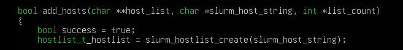
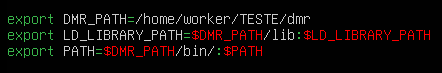

## OpenMPI 5

```bash
wget https://download.open-mpi.org/release/open-mpi/v5.0/openmpi-5.0.9.tar.gz
```

```bash
tar -xf openmpi-5.0.9.tar.gz
cd openmpi-5.0.9
```

```bash
./configure --prefix=<caminho_onde_instalar>
```

```bash
make -j$(nproc)
make install
```

---

## DMR

Clone o repositório do DMR:

```bash
git clone https://gitlab.bsc.es/siserte/dmr.git
```

---

Ensure that your compiler can also find the include header files of Slurm on its search paths or set the SLURM_INCLUDE environment variable to point to them. If they are not exposed on your system, you may be able to get around the problem by getting them from the appropriate version of Slurm's GitHub page.

Clone o Slurm:

```bash
git clone https://github.com/SchedMD/slurm.git
cd slurm
```

```bash
git checkout slurm-23.11
```

```bash
./configure
```
---

Adicione no ~/.bashrc:

```bash
export SLURM_LIB=/usr/lib/x86_64-linux-gnu/slurm-wlm
export LD_LIBRARY_PATH=$SLURM_LIB:$LD_LIBRARY_PATH
export SLURM_INCLUDE=<caminho_para_o_slurm_clonado>
```


---


Please note that the current version of dmr@jobs was built primarily to support Slurm 23.02.7 and that versions other than this may not work or require adjustments

Vá para dmr/src/dmr_slurm.c

É necessário modificar a linha hostlist:

de:



para:


---

Agora é possível dar make na pasta dmr sem erros

Entre no diretório do DMR e execute:

```bash
make
```

---


Adicione também ao ~/.bashrc:

```bash
export DMR_PATH=<localização_do_diretório_dmr>
export LD_LIBRARY_PATH=$DMR_PATH/lib:$LD_LIBRARY_PATH
export PATH=$DMR_PATH/bin:$PATH
```



---

Em dmr/examples/hello-world-dmr/ altere o Makefile para o que está neste repositório

Faça make


Altere o sbatch para adicionar o flag -x, caso contrario, nao sera possivel encontrar o .so do dmr com o arquivo no repositorio 
ou simplesmente no comando:
cmd="$DMR_PATH/bin/dmr_wrapper prterun --host $NODELIST_WITH_COUNTS -np 2 --prtemca ras ^slurm --prtemca plm ^slurm -x LD_LIBRARY_PATH=/home/worker/TESTE/dmr/lib:$LD_LIBRARY_PATH ./hello-world"
adicione:
-x LD_LIBRARY_PATH=caminho/dmr/lib:$LD_LIBRARY_PATH


